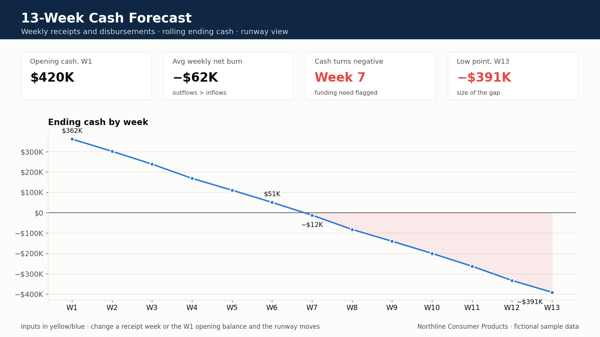

# 13-week cash forecast

Weekly cash view for a fictional company (**Northline Consumer Products**).

**Deliverable:** [`Northline_13_Week_Cash_Forecast.xlsx`](Northline_13_Week_Cash_Forecast.xlsx)

## Business question

The monthly P&L can look fine while Friday cash is tight. Can payroll and vendors clear if a large receipt slips one week?

## How to review this file (8 minutes)

1. Open the weekly cash tab. Read starting cash, receipts, disbursements, ending cash.
2. Find the comfort / runway line.
3. Push the largest customer receipt out 7 days (yellow / blue input).
4. Check whether any week crosses the comfort line. Black font is formulas.

## Screen-share tests

| Driver | What to do | What should move |
| --- | --- | --- |
| Large customer receipt | Push it out 7 days | Ending cash in the original week drops; next week recovers |
| Payroll week | Leave it fixed | Shows a true trough vs pure timing |
| Vendor terms | Delay one disbursement cluster | Tests runway without a draw |

If a week goes through the comfort line after the receipt slip, the story is “call collections and freeze discretionary spend,” not “wait for month-end.”

## What you will see

- Starting cash
- Customer receipts by week
- Payroll, vendors, tax, and other disbursements
- Ending cash each week
- A short runway note if cash falls below a comfort line

Excel formulas only. No VBA, no live bank feed, no employer data. This is the weekly treasury conversation, not the annual plan.

[Profile](https://github.com/saisiri1207) · [Portfolio](https://saisiri1207.github.io) · [LinkedIn](https://www.linkedin.com/in/saisiri1207) · [bandarusaisiri1207@gmail.com](mailto:bandarusaisiri1207@gmail.com)
